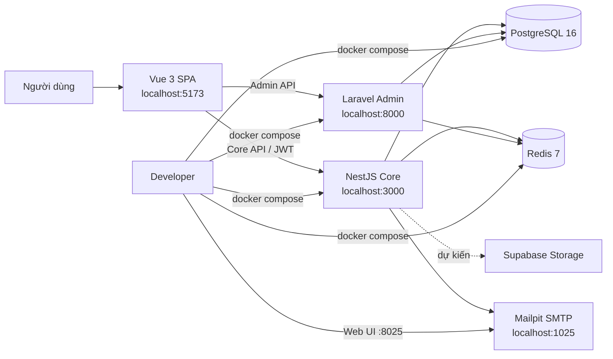
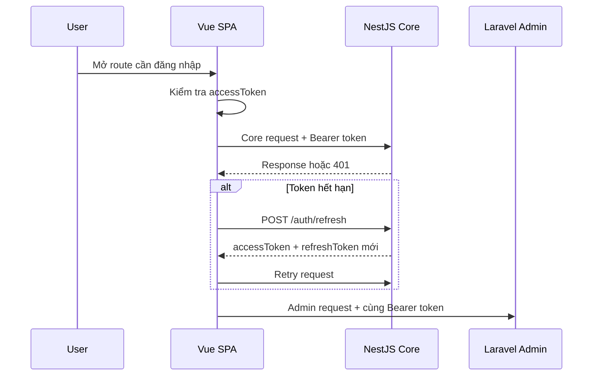
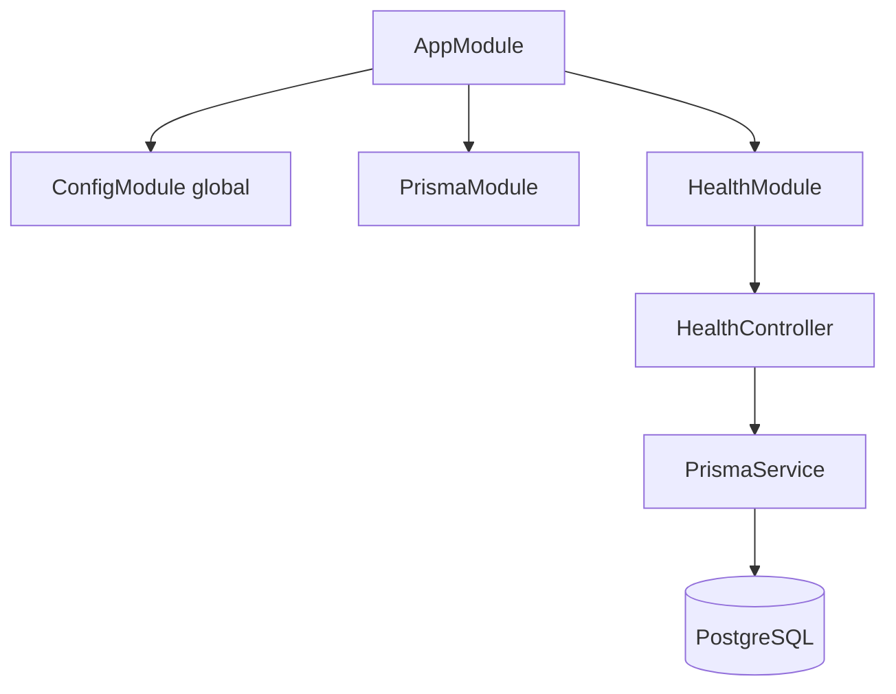
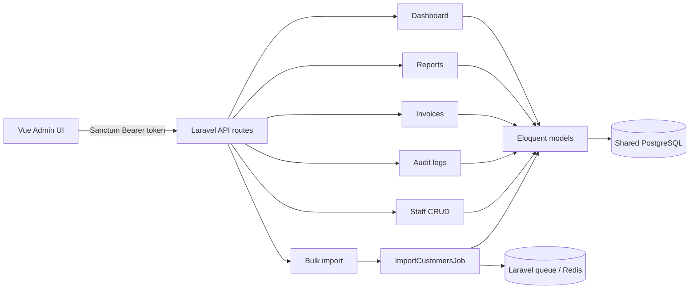
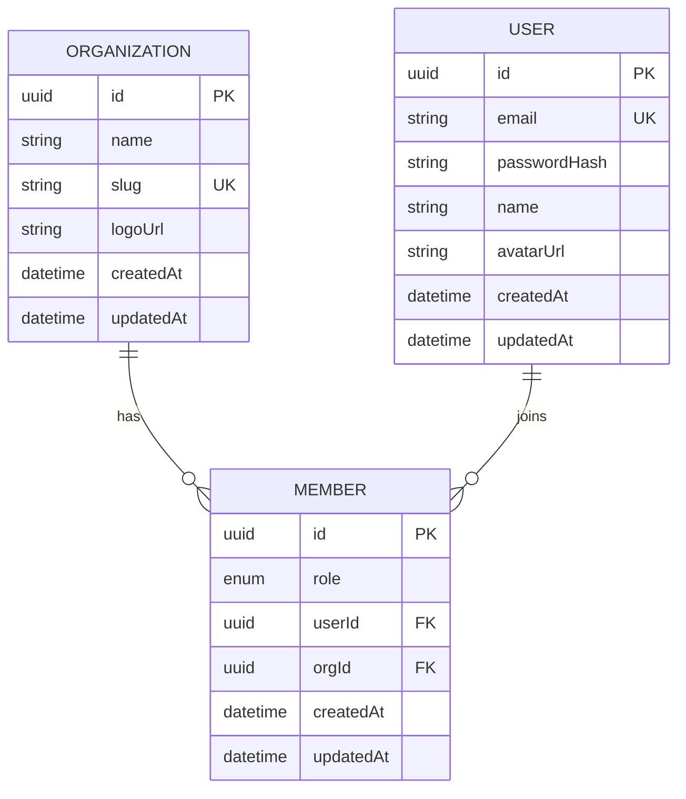
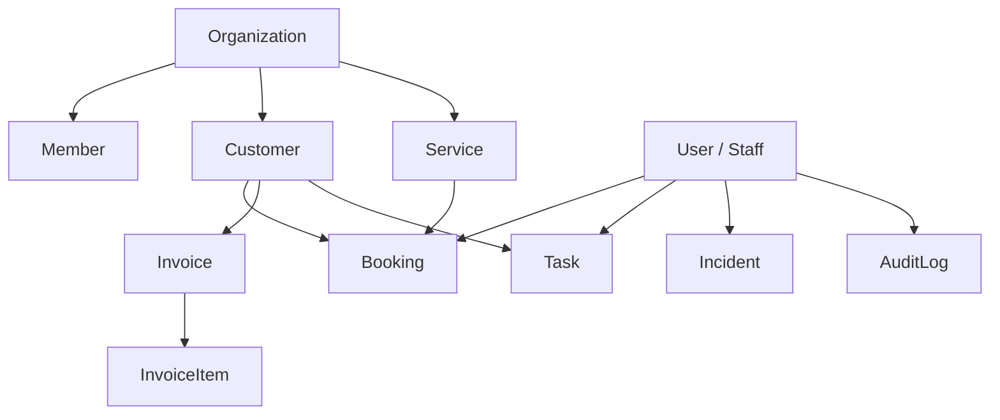
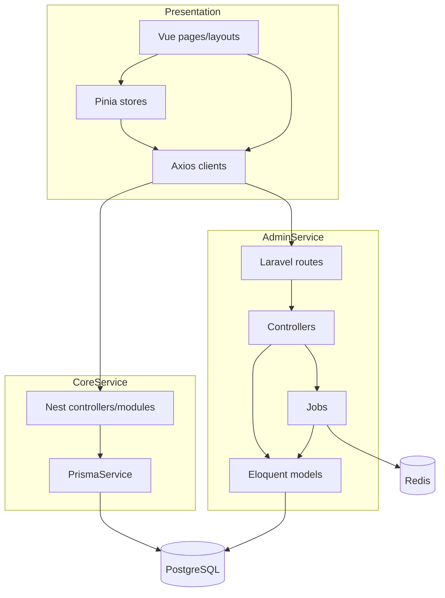

# TeamOps Project Map

> Bản đồ này mô tả **code đang tồn tại trong repository** tại thời điểm cập nhật, đồng thời phân biệt phần đã triển khai với kiến trúc mục tiêu trong [`docs/plans/teamops-microservices.md`](plans/teamops-microservices.md).
>
> **Phạm vi diễn giải:** yêu cầu “tạo map cho project” không chỉ rõ loại map. Tài liệu này hiểu “map” là **codebase map phục vụ onboarding và phát triển**, gồm cấu trúc thư mục, service, route/API, mô hình dữ liệu, dependency flow, hạ tầng và khoảng cách giữa kế hoạch với implementation. Đây không phải sitemap UI thuần túy hay bản vẽ deployment production.

## 1. Tổng quan

TeamOps là nền tảng vận hành multi-tenant cho studio hoặc agency, được tổ chức theo mô hình SPA + hai backend service dùng chung hạ tầng dữ liệu.



### Trách nhiệm dự kiến

| Thành phần | Công nghệ | Trách nhiệm |
|---|---|---|
| `frontend/` | Vue 3, TypeScript, Vite, Pinia | SPA, routing, auth state, giao diện nghiệp vụ và admin |
| `services/core/` | NestJS, Prisma | Auth/JWT, nghiệp vụ chính, realtime, queue và file upload |
| `services/admin/` | Laravel, Eloquent, Horizon | Dashboard, báo cáo, hóa đơn, bulk import, audit và quản trị nhân sự |
| PostgreSQL | PostgreSQL 16 | Database dùng chung giữa Core và Admin |
| Redis | Redis 7 | Cache, session và queue broker |
| Mailpit | SMTP + Web UI | Kiểm thử email trong môi trường local |

## 2. Cấu trúc repository

```text
teamops/
├── README.md                         # Giới thiệu và hướng dẫn khởi động
├── docker-compose.yml                # PostgreSQL, Redis, Core, Admin, Mailpit
├── docs/
│   ├── PROJECT_MAP.md                # Tài liệu hiện tại
│   └── plans/
│       ├── teamops-microservices.md  # Thiết kế kiến trúc và roadmap mục tiêu
│       └── figma-design-prompt.md     # Định hướng thiết kế UI
├── frontend/                         # Vue SPA
│   ├── src/
│   │   ├── api/                      # Axios client cho Core và Admin
│   │   ├── composables/              # Logic Vue tái sử dụng
│   │   ├── layouts/                  # DefaultLayout và AdminLayout
│   │   ├── pages/                    # Trang auth và dashboard
│   │   ├── router/                   # Route map và auth guard
│   │   ├── stores/                   # Pinia auth và UI state
│   │   ├── types/                    # TypeScript domain types
│   │   ├── App.vue                   # Root component
│   │   └── main.ts                   # Frontend entrypoint
│   └── vite.config.ts                # Alias @ và dev proxy
└── services/
    ├── core/                         # NestJS service
    │   ├── prisma/
    │   │   ├── schema.prisma         # Schema hiện tại: Organization/User/Member
    │   │   └── migrations/           # Prisma migrations
    │   └── src/
    │       ├── common/                # Guard, filter, interceptor dùng chung
    │       ├── health/                # Health và DB health endpoints
    │       ├── prisma/                # Prisma module/service
    │       ├── app.module.ts          # Root Nest module
    │       └── main.ts                # Nest bootstrap
    └── admin/                        # Laravel service
        ├── app/
        │   ├── Http/Controllers/      # Health và Admin API controllers
        │   ├── Http/Requests/         # Request validation
        │   ├── Jobs/                  # Background import job
        │   └── Models/                # Eloquent models dùng database chung
        ├── config/                    # App, auth, DB, queue, Horizon
        ├── database/migrations/       # Laravel system migrations hiện có
        ├── routes/                    # api.php, web.php, console.php
        └── tests/                     # Laravel example tests
```

## 3. Frontend map

### Entrypoint và routing

```mermaid
flowchart TD
    MAIN[frontend/src/main.ts] --> APP[App.vue]
    MAIN --> PINIA[Pinia]
    MAIN --> ROUTER[router/index.ts]

    ROUTER --> PUBLIC[Public routes]
    PUBLIC --> LOGIN[/login]
    PUBLIC --> REGISTER[/register]
    PUBLIC --> FORGOT[/forgot-password<br/>placeholder]

    ROUTER --> DEFAULT[DefaultLayout]
    DEFAULT --> DASH[/dashboard]
    DEFAULT --> CUSTOMERS[/customers<br/>placeholder]
    DEFAULT --> BOOKINGS[/bookings<br/>placeholder]
    DEFAULT --> TASKS[/tasks<br/>placeholder]
    DEFAULT --> INCIDENTS[/incidents<br/>placeholder]
    DEFAULT --> NOTIFICATIONS[/notifications<br/>placeholder]

    ROUTER --> ADMIN_LAYOUT[AdminLayout]
    ADMIN_LAYOUT --> ADASH[/admin/dashboard<br/>placeholder]
    ADMIN_LAYOUT --> REPORTS[/admin/reports<br/>placeholder]
    ADMIN_LAYOUT --> INVOICES[/admin/invoices<br/>placeholder]
    ADMIN_LAYOUT --> AUDIT[/admin/audit-log<br/>placeholder]
```

### API clients và auth

- `src/api/core.ts` gọi trực tiếp `http://localhost:3000`.
- `src/api/admin.ts` gọi trực tiếp `http://localhost:8000`.
- Cả hai client lấy `accessToken` từ `localStorage` và gắn Bearer token.
- Khi nhận HTTP 401, client gọi `POST http://localhost:3000/auth/refresh`, lưu cặp token mới rồi retry request.
- `src/stores/auth.ts` cung cấp `login`, `register`, `logout`, `refreshAccessToken`.
- Router guard hiện chỉ kiểm tra sự tồn tại của `localStorage.accessToken`.



> Lưu ý: flow auth phía frontend đã được dựng, nhưng Core hiện chưa có `AuthModule` hoặc các endpoint `/auth/*`.

### Vite proxy

`frontend/vite.config.ts` có hai proxy:

| Prefix frontend | Target | Rewrite |
|---|---|---|
| `/api` | `http://localhost:3000` | bỏ `/api` |
| `/admin-api` | `http://localhost:8000` | đổi thành `/api` |

Hiện Axios clients dùng URL tuyệt đối nên chưa tận dụng các proxy này.

## 4. Core service map

### Bootstrap

`services/core/src/main.ts`:

1. Khởi tạo `AppModule`.
2. Bật CORS.
3. Đăng ký `ValidationPipe` toàn cục với whitelist, reject field lạ và transform input.
4. Lắng nghe tại `PORT`, mặc định `3000`.

### Module đang hoạt động



| Endpoint | Trạng thái | Mục đích |
|---|---|---|
| `GET /health` | Đã có | Kiểm tra process Core |
| `GET /health/db` | Đã có | Chạy `SELECT 1` qua Prisma |
| `/auth/*` | Chưa có | Frontend đang kỳ vọng login/register/refresh |
| Customer/Booking/Task/... | Chưa có | Mới được ghi chú placeholder trong `AppModule` |

### Common infrastructure đã có source

- `common/guards/jwt-auth.guard.ts`
- `common/guards/roles.guard.ts`
- `common/filters/http-exception.filter.ts`
- `common/interceptors/audit-log.interceptor.ts`

Các file này là nền tảng cho auth, phân quyền, error handling và audit, nhưng chưa được nối vào feature module trong `AppModule`.

## 5. Admin service map

### API routes

Tất cả route dưới `/api/admin` dùng middleware `auth:sanctum`.

| Method | Route | Controller action |
|---|---|---|
| `GET` | `/api/health` | `HealthController@index` |
| `GET` | `/api/admin/dashboard` | `DashboardController@index` |
| `GET` | `/api/admin/reports/bookings` | `ReportController@bookingsByPeriod` |
| `GET` | `/api/admin/reports/revenue` | `ReportController@revenueByPeriod` |
| `GET` | `/api/admin/reports/cancellation-stats` | `ReportController@cancellationStats` |
| `GET` | `/api/admin/invoices` | `InvoiceController@index` |
| `GET` | `/api/admin/invoices/{id}` | `InvoiceController@show` |
| `PUT` | `/api/admin/invoices/{id}` | `InvoiceController@update` |
| `GET` | `/api/admin/invoices/{id}/export-pdf` | `InvoiceController@exportPdf` |
| `GET` | `/api/admin/audit-logs` | `AuditLogController@index` |
| `POST` | `/api/admin/bulk-import/customers` | `BulkImportController@importCustomers` |
| REST | `/api/admin/staff` | `StaffController` resource actions |

### Admin processing flow



### Eloquent models hiện có

- `Organization`
- `User`
- `Member`
- `Customer`
- `ServiceModel` → bảng `services`
- `Booking`
- `TaskModel` → bảng `tasks`
- `Invoice`
- `InvoiceItem`
- `Incident`
- `AuditLog`

Laravel đã có model và controller cho domain rộng hơn schema Prisma hiện tại. Tuy nhiên migrations trong `services/admin/database/migrations/` mới chủ yếu là migrations mặc định của Laravel. Vì hai service dùng chung database, cần xác định **một nguồn sở hữu schema/migration duy nhất** để tránh lệch schema.

## 6. Data model hiện được Prisma quản lý



Ràng buộc chính:

- `Organization.slug` unique.
- `User.email` unique.
- Cặp `Member(userId, orgId)` unique.
- Xóa user hoặc organization sẽ cascade sang member.
- `MemberRole`: `OWNER`, `ADMIN`, `STAFF`.

### Domain mở rộng đang được Laravel tham chiếu



Các bảng mở rộng phía trên cần được đối chiếu hoặc bổ sung vào migration/schema trước khi coi là database contract hoàn chỉnh.

## 7. Hạ tầng local

| Container | Port host | Dependency | Dữ liệu |
|---|---:|---|---|
| `teamops-postgres` | `5432` | Không | volume `pgdata` |
| `teamops-redis` | `6379` | Không | volume `redisdata` |
| `teamops-core` | `3000` | PostgreSQL, Redis healthy | bind mount `services/core` |
| `teamops-admin` | `8000` | PostgreSQL, Redis healthy | bind mount `services/admin` |
| `teamops-mailpit` | `1025`, `8025` | Không | SMTP và Web UI |

### Shared resources

- Database: `teamops`
- Database user: `teamops`
- Core và Admin cùng kết nối PostgreSQL.
- Core và Admin cùng dùng Redis host `redis`.
- Admin cấu hình queue, session và cache trên Redis.
- Kiến trúc mục tiêu dự kiến tách Redis DB cho BullMQ và Laravel Queue, nhưng Compose hiện chưa chỉ rõ DB index.

## 8. Luồng phụ thuộc chính



## 9. Trạng thái triển khai

| Khu vực | Trạng thái hiện tại |
|---|---|
| Docker local infrastructure | Có cấu hình PostgreSQL, Redis, Core, Admin, Mailpit |
| Frontend shell | Có layout, router, auth pages, dashboard page, Pinia và API clients |
| Frontend feature pages | Phần lớn route nghiệp vụ đang trỏ về dashboard placeholder |
| Core health | Hoạt động ở mức source, gồm process health và DB health |
| Core auth | Chưa được triển khai dù frontend đã gọi `/auth/*` |
| Core domain modules | Chưa có, mới là placeholders trong `AppModule` |
| Prisma schema | Có Organization, User, Member |
| Admin APIs | Đã có routes/controllers/models cho dashboard, reports, invoices, audit, import, staff |
| Admin authentication | Route yêu cầu Sanctum, nhưng cần kiểm tra cơ chế phát hành/chia sẻ token với Core |
| Database domain schema | Chưa đồng bộ hoàn toàn giữa Prisma, Laravel models và migrations |
| Queue | Dependency/config đã có, Laravel có import job, Core chưa nối BullMQ module |
| Realtime/File storage | Có dependency hoặc định hướng, chưa thấy feature implementation |
| Automated tests | Chỉ thấy Laravel example tests, chưa thấy test nghiệp vụ Core/Frontend |

## 10. Các điểm tích hợp cần chú ý

1. **Auth contract:** Frontend mặc định Core phát JWT, còn Admin route dùng `auth:sanctum`. Cần thống nhất cách Laravel xác thực token do Core phát hành hoặc thay đổi cơ chế auth.
2. **Database ownership:** Prisma mới định nghĩa ba model trong khi Laravel đọc nhiều bảng domain. Nên chỉ định Core/Prisma hoặc một cơ chế migration trung tâm làm nguồn sự thật.
3. **Tenant isolation:** Các truy vấn admin hiện cần được rà soát để luôn scope theo `organization_id`, tránh đọc dữ liệu xuyên tenant.
4. **API base URL:** Có cả Vite proxy và URL tuyệt đối. Nên chuẩn hóa qua biến môi trường để chạy được ngoài localhost.
5. **Schema naming:** Prisma có một số field camelCase chưa map sang snake_case, trong khi Laravel mặc định dùng snake_case. Cần giữ mapping nhất quán.
6. **Queue namespace:** Core BullMQ và Laravel Horizon dùng chung Redis. Nên tách DB index hoặc prefix queue rõ ràng.
7. **Implementation gap:** README và plan mô tả hệ thống gần hoàn chỉnh hơn code Core/Frontend thực tế. Khi onboarding nên dùng mục “Trạng thái triển khai” trong tài liệu này làm mốc.

## 11. Thứ tự đọc code đề xuất

### Nếu làm frontend

1. `frontend/src/main.ts`
2. `frontend/src/router/index.ts`
3. `frontend/src/stores/auth.ts`
4. `frontend/src/api/core.ts` và `frontend/src/api/admin.ts`
5. `frontend/src/layouts/`
6. `frontend/src/pages/`

### Nếu làm Core API

1. `services/core/src/main.ts`
2. `services/core/src/app.module.ts`
3. `services/core/src/health/`
4. `services/core/src/prisma/`
5. `services/core/prisma/schema.prisma`
6. `services/core/src/common/`

### Nếu làm Admin API

1. `services/admin/routes/api.php`
2. `services/admin/app/Http/Controllers/Admin/`
3. `services/admin/app/Models/`
4. `services/admin/app/Jobs/`
5. `services/admin/config/auth.php`
6. `services/admin/config/database.php` và `config/queue.php`

## 12. Roadmap kỹ thuật hợp lý từ trạng thái hiện tại

1. Chốt database contract và migration owner.
2. Triển khai Core `AuthModule`, JWT refresh flow và organization context.
3. Chốt auth bridge giữa NestJS JWT và Laravel Sanctum/middleware.
4. Thêm tenant scoping bắt buộc cho tất cả truy vấn.
5. Triển khai lần lượt Customer → Service → Booking → Task → Incident → Invoice.
6. Thay các frontend placeholder bằng feature pages thật.
7. Kết nối BullMQ, Horizon, notification và realtime.
8. Bổ sung unit, integration và E2E tests cho các luồng auth và tenant isolation trước tiên.
